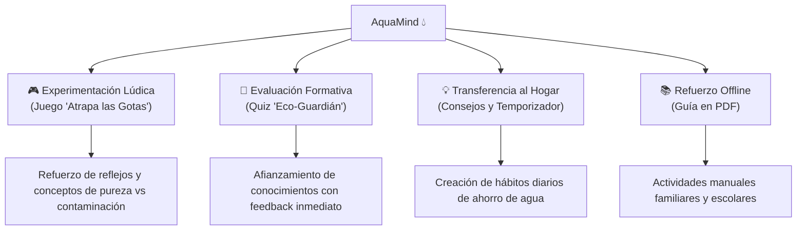

# 💧 AquaMind - Plataforma Educativa para el Cuidado del Agua

[]()
[]()
[]()
[-purple.svg)]()
[]()

> **AquaMind** es una plataforma web educativa, lúdica e interactiva diseñada para enseñar, concientizar y motivar a niños y niñas de **6 a 10 años** sobre la importancia vital del agua, su uso responsable, el cuidado de los ecosistemas y el ahorro en el hogar.

---

## 📑 Tabla de Contenidos

1. [🌟 Descripción General](#-descripción-general)
2. [🚀 Módulos y Experiencias Interactivas](#-módulos-y-experiencias-interactivas)
   - [🎮 Mini-Juego: ¡Atrapa las Gotas!](#1--mini-juego-atrapa-las-gotas)
   - [🧠 Quiz Interactivo: Eco-Guardián](#2--quiz-interactivo-eco-guardián)
   - [💡 Módulo de Consejos y Retos del Agua](#3--módulo-de-consejos-y-retos-del-agua)
   - [🎬 Videoteca Educativa Dinámica](#4--videoteca-educativa-dinámica)
   - [📚 Material Didáctico Descargable](#5--material-didáctico-descargable)
3. [📁 Estructura del Proyecto](#-estructura-del-proyecto)
4. [💻 Tecnologías y Arquitectura](#-tecnologías-y-arquitectura)
5. [🛠️ Cómo Ejecutar el Proyecto](#️-cómo-ejecutar-el-proyecto)
6. [🎯 Enfoque Pedagógico y Gamificación](#-enfoque-pedagógico-y-gamificación)
7. [🏫 Contexto Institucional](#-contexto-institucional)
8. [👥 Contribuciones y Licencia](#-contribuciones-y-licencia)

---

## 🌟 Descripción General

AquaMind transforma el aprendizaje ambiental en una aventura interactiva para la infancia. A través de dinámicas de juego, desafíos de conocimiento, herramientas cotidianas y recursos visuales, los niños descubren cómo sus acciones diarias tienen un impacto directo en el planeta.

### Principales bondades de diseño:
- **100% Nativo y Autónomo:** No requiere frameworks pesados, librerías externas ni registros previos.
- **Diseño Adaptativo (*Mobile-First*):** Optimizado para pantallas táctiles (smartphones y tablets) y computadores de escritorio.
- **Identidad Visual Infantil:** Paleta de colores atractiva, microanimaciones y tipografías amigables (*Fredoka* y *Quicksand*).
- **Audio Sintetizado:** Efectos de sonido dinámicos generados en tiempo real mediante la *Web Audio API*.

---

## 🚀 Módulos y Experiencias Interactivas

### 1. 🎮 Mini-Juego: ¡Atrapa las Gotas!
Un dinámico juego arcade en el navegador:
- **Objetivo:** Mover la cubeta recolectora para atrapar agua limpia (💧 **+10 pts**), burbujas ecológicas (🧼 **+25 pts**) y gotas doradas especiales (🌟 **+50 pts**), evitando los barriles de residuos tóxicos (🛢️ **-1 vida**).
- **Ecosistemas:** Progresión a través de diferentes niveles y biomas acuáticos (*El Manantial*, *El Río Cristalino*, *El Gran Océano*).
- **Controles Multidispositivo:** Compatible con teclado (flechas `←` / `→`), arrastre con ratón y deslizamiento táctil en pantalla.
- **HUD Completo:** Vidas visuales (❤️), medidor de tiempo, nivel de llenado de cubeta, sistema de partículas y récord guardado en `localStorage`.

### 2. 🧠 Quiz Interactivo: Eco-Guardián
Un módulo nativo de evaluación diagnóstica y formativa de 10 preguntas:
- **Temáticas Clave:** Huella hídrica, ciclo del agua, conservación de ríos y océanos, y hábitos de ahorro en el hogar.
- **Retroalimentación Inmediata:** Explicaciones didácticas al responder cada pregunta para afianzar el aprendizaje.
- **Sistema de Rachas y Puntos:** Bonificaciones por aciertos continuos (🔥 racha).
- **Ceremonia de Resultados:** Lluvia de confeti mediante Canvas, medallas personalizadas y rangos alcanzables (*Gran Guardián del Agua*, *Defensor de los Ríos*, *Protector del Manantial*, *Pequeño Aprendiz*).

### 3. 💡 Módulo de Consejos y Retos del Agua
Herramientas prácticas para llevar la teoría a la vida real:
- **Consejos Ilustrados:** Tarjetas con recomendaciones fáciles y visuales para el día a día.
- **Sección "¿Sabías que...?":** Datos curiosos y revelaciones científicas adaptadas para niños.
- **Temporizador de Ducha Interactivo:** Cronómetro visual con alertas sonoras para motivar duchas de máximo 3 a 5 minutos.
- **Insignias y Medallas:** Logros desbloqueables al explorar consejos.
- **Compromiso Ecohéroe:** Generación simbólica del pacto familiar por el agua.

### 4. 🎬 Videoteca Educativa Dinámica
Carrusel multimedia con miniaturas y visualización directa de contenidos audiovisuales seleccionados:
1. 💧 *El Ciclo del Agua y su Importancia*
2. 🚰 *¿Cómo Cuidar el Agua en Casa?*
3. 🌧️ *La Aventura de la Gota de Agua*
4. 💡 *Consejos Divertidos para Ahorrar Agua*
5. 🌍 *Cada Gota Cuenta para el Planeta*
6. 🏞️ *¡Misión Salvemos los Ríos!*

### 5. 📚 Material Didáctico Descargable
- **Guía Educativa Oficial (PDF):** Documento imprimible de alta calidad (`Anexos/Guia_Educativa.pdf`) con actividades prácticas, dibujos para colorear y dinámicas para trabajar en el aula o en el hogar sin necesidad de internet.

---

## 📁 Estructura del Proyecto

```text
Proyecto_ing1_cuidado_del_agua/
│
├── index.html                      # Portal principal de bienvenida y navegación
├── styles.css                      # Estilos globales, variables CSS y diseño responsive
├── script.js                       # Lógica de navegación y carrusel de videos
│
├── Juegos/
│   ├── Atrapar/                    # Mini-juego "¡Atrapa las Gotas!"
│   │   ├── index.html              # Estructura del juego y HUD
│   │   ├── styles.css              # Estilos, efectos visuales y animaciones
│   │   ├── script.js               # Motor de físicas, colisiones y audio sintético
│   │   └── assets/                 # Recursos gráficos adicionales
│   │
│   └── Quiz/                       # Módulo del Quiz "Eco-Guardián"
│       ├── index.html              # Interfaz interactiva del cuestionario
│       ├── styles.css              # Estilos, diseño de tarjetas y pantalla de resultados
│       └── script.js               # Banco de preguntas, feedback, audio y confeti
│
├── Proyecto Consejos/              # Módulo de hábitos sostenibles y temporizador
│   ├── index.html                  # Interfaz de consejos, medallas y cronómetro
│   └── Imagenes/                   # Ilustraciones y recursos visuales
│
├── Anexos/
│   └── Guia_Educativa.pdf          # Cuadernillo pedagógico descargable en PDF
│
├── imagenes/                       # Iconos, favicons y assets globales
└── README.md                       # Documentación técnica y pedagógica del proyecto
```

---

## 💻 Tecnologías y Arquitectura

| Componente | Tecnología | Uso en el Proyecto |
|---|---|---|
| **Estructura** | HTML5 Semántico | Marcado accesible, etiquetas ARIA y organización modular. |
| **Estilos** | CSS3 Moderno | Flexbox, CSS Grid, variables (`var(--...)`), animaciones y media queries. |
| **Lógica** | JavaScript (ES6+) | Manipulación del DOM, control de flujo, eventos touch/mouse/keyboard. |
| **Audio** | Web Audio API | Generación procedimental de tonos y efectos de sonido (sin archivos MP3 pesados). |
| **Visuales** | HTML5 Canvas & SVG | Efecto de confeti para celebraciones y gráficos vectoriales escalables. |
| **Persistencia** | Web Storage API | Guardado de mejores puntuaciones locales (`localStorage`). |
| **Fuentes** | Google Fonts | Tipografías abiertas *Fredoka* y *Quicksand*. |

---

## 🛠️ Cómo Ejecutar el Proyecto

No se requieren compiladores ni servidores backend. Funciona directamente en cualquier navegador moderno:

### Opción 1: Apertura Directa
1. Descarga o clona el repositorio:
   ```bash
   git clone https://github.com/Kscf27/Proyecto_ing1_cuidado_del_agua.git
   ```
2. Abre el archivo `index.html` en tu navegador favorito (Chrome, Edge, Firefox, Safari u Opera).

### Opción 2: Servidor Local de Desarrollo (Live Server)
Si utilizas **Visual Studio Code**:
1. Instala la extensión **Live Server**.
2. Abre la carpeta del proyecto en VS Code.
3. Haz clic derecho en `index.html` y selecciona **"Open with Live Server"**.

---

## 🎯 Enfoque Pedagógico y Gamificación



---

## 🏫 Contexto Institucional

Proyecto concebido y desarrollado en el ámbito formativo de la **Universidad Nacional Abierta y a Distancia (UNAD)** dentro de la *Escuela de Ciencias Básicas, Tecnología e Ingeniería (ECBTI)*, con el propósito de integrar las Tecnologías de la Información y las Comunicaciones (TIC) en la educación ambiental comunitaria.

---

## 👥 Contribuciones y Licencia

Las sugerencias, mejoras y nuevas actividades didácticas son bienvenidas:
1. Haz un **Fork** del repositorio.
2. Crea tu rama (`git checkout -b feature/NuevaActividad`).
3. Realiza tus cambios y haz commit (`git commit -m 'Añade nueva actividad interactiva'`).
4. Envía tu rama (`git push origin feature/NuevaActividad`).
5. Abre un **Pull Request**.

Distribuido como material de código abierto con propósitos educativos y de concientización ambiental.
